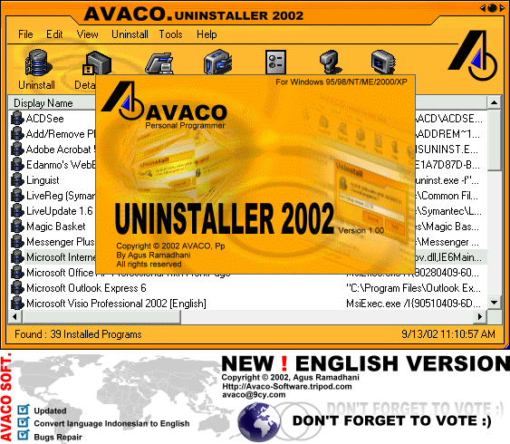



## Avaco Uninstaller 2002 \- \[Updated : New \! English Version\]

### Description

Updated !! New English Version. This is new update on my program.

Sorry my English is very Bad :).

But i try to Convert my program from Indonesian Language to English. I hope that for helping.

Ok, this is complete program uninstaller or add/remove for windows. On this program you can:

- Easy to uninstaller or add/remove program

- Edit Entry on uninstall registry

- New Entry on uninstall registry

- Delete Entry on uninstall registry

- Create Backup Registry (Export and import Registry)

- Create Report about information program registry

- Look Detail Information program on registry

- Look Location Program Groups

- And any Other.....Thanks and don't forget to vote:)
 
### More Info
 

             |
---                |---
**Submitted On**   |2002-09-15 00:37:38
**By**             |[oom avaco](https://github.com/Planet-Source-Code/PSCIndex/blob/master/ByAuthor/oom-avaco.md)
**Level**          |Advanced
**User Rating**    |5.0 (460 globes from 92 users)
**Compatibility**  |VB 5\.0, VB 6\.0
**Category**       |[Windows System Services](https://github.com/Planet-Source-Code/PSCIndex/blob/master/ByCategory/windows-system-services__1-35.md)
**World**          |[Visual Basic](https://github.com/Planet-Source-Code/PSCIndex/blob/master/ByWorld/visual-basic.md)
**Archive File**   |[Avaco\_Unin1314179152002\.zip](https://github.com/Planet-Source-Code/oom-avaco-avaco-uninstaller-2002-updated-new-english-version__1-38980/archive/master.zip)

